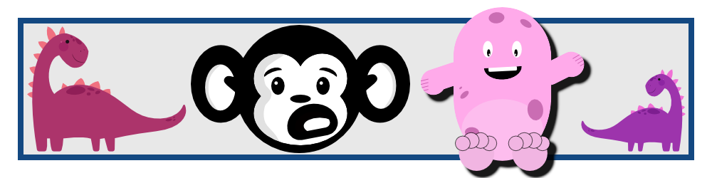

# Affinity Designer For Beginners

This project is my course work for the [Affinity Designer For Beginners - Updated For Version 2](https://www.udemy.com/course/affinity-designer-for-beginners-version-2/) class on Udemy.  The course is taught by Ally Anderson under the name [Affinity Revolution](https://affinityrevolution.com/).  I am getting the full soon but I used the 7 day trial to complete this.  I recommend trying it out.


I was amazed at the content I was able to produce in this course.  I am not artistic but Ally took me through every step to produce images I am proud of.  I really love the EXPLORE badge!

### Details
This project was completed on Affinity Designer 2.4.2 on 2024-06-06.  You can clone my repository but the course files might have any changes since I completed the course.


### Architecture Requirements
- Affinity Designer is required on either Windows or Mac.
- There are a few different places to get the course like [https://affinityrevolution.com/](https://affinityrevolution.com/) and Udemy.

### Git Notes

Clone the project to develop or change it.

```sh
git clone https://github.com/ShonHarsh/Affinity-Designer-For-Beginners
```



### Links
- [Udemy - Affinity Designer For Beginners](https://www.udemy.com/course/affinity-designer-for-beginners-version-2)
- [Affinity Suite](https://affinity.serif.com/en-us/)
- [Pulsar](https://pulsar-edit.dev/) (Atom Successor) - Used for all my README.md files
- [Shon Harsh Website 127.0.0.1](https://shonharsh.github.io/curriculum-vitae/index.html)
- [This.GitHub](https://github.com/shonharsh)
- [LinkedIn](https://www.linkedin.com/in/shonharsh/)

[](https://www.udemy.com/user/affinityrevolution/)
